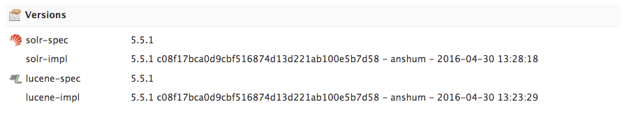
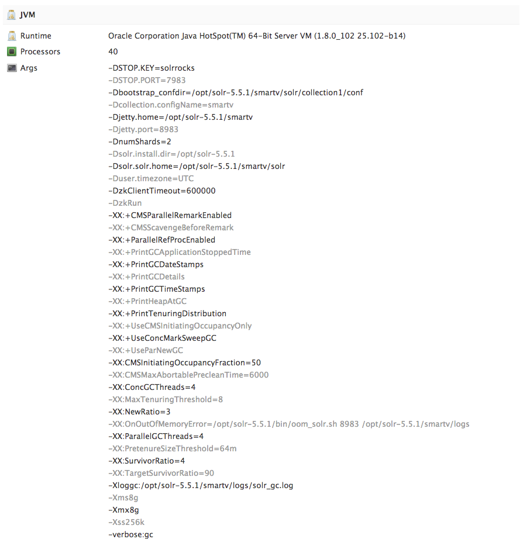
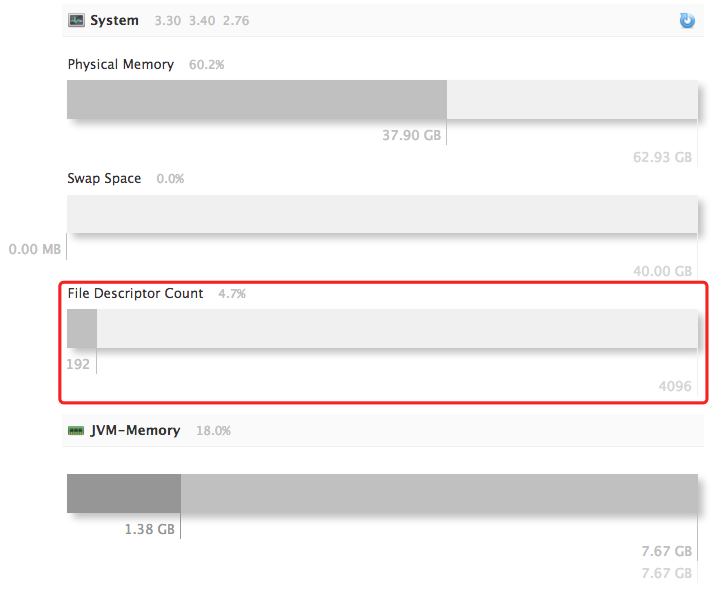

# 《Solr实战》读书笔记


## 12.搭建Solr生产环境

### 12.3 硬件配置和服务器配置

#### 12.3.1 内存和固态硬盘

- `Solr`进行`分面`、`排序`、`索引文档`和`查询请求缓存`时会消耗大量内存。
- `Solr`索引能否完全载入当前服务器 **未分配** 给`JVM`的可用内存空间中。
- 在查询性能优化时，保证所有索引都能加载到内存中 比 使用`SSD`更好。
- 在索引性能优化时，替换`SSD`为更好的选择。

#### 12.3.2 JVM设置

- `JVM`内存空间只用来 存储核心数据结构（`缓存："主要由字段缓存、过滤器缓存、历史查询缓存组成"`、`Solr内核`和`其他内存数据结构`）和 执行查询操作。
- **必须不能分配太多的内存给JVM**，因为需要留下更多的系统内存用来存储索引数据。
- 如果要求在大多数时间里`Solr`都能达到最佳性能，并且允许某段时间长期地暂停服务（无响应），那么可以选择`吞吐垃圾回收器（Throughput Garbage Collector）`。
- 如果追求的是长时间稳定的性能，可以使用`并发标记清楚回收器（Concurrent Marksweep Garbage Collector）`。

> 添加 `Solr5` 默认 `JVM` 配置。





#### 12.3.3 索引切换

##### 增量索引

- 索引创建遵循`增量索引`原则，即总是将修改添加到新文档中，而不添加到之前已写入文档中。
- `硬提交`操作会启动一个`新的搜索器`，`新的搜索器`会创建新的`索引（旧的索引块 + 新增的索引块）`。

##### 索引切换和缓存预热

- 在每一次提交时，`Solr`会`预热缓存（JVM中的缓存）`，即从`旧的搜索器`中将`缓存（JVM缓存包括：历史查询、过滤器、字段值等）`移动至`新的搜索器`中。

```xml
<!-- solrconfig.xml -->
<!-- 缓存越大，提交（commit）时间越久（因为新的 searcher 预热时间会越久）。 -->
<fieldValueCache class="solr.FastLRUCache" size="512" autowarmCount="128" showItems="32" />
<filterCache class="solr.FastLRUCache" size="20480" initialSize="20480" autowarmCount="4096" />
<queryResultCache class="solr.LRUCache" size="20480" initialSize="20480" autowarmCount="4096"/>
<documentCache class="solr.LRUCache" size="20480" initialSize="20480" autowarmCount="4096" />
```

- `缓存`的大小越大，则`新搜索器`需要预热的时间就越久，创建索引的时间越长。
- `autowarmCount`值越高，创建索引时间越久（在对于`filterCache`配置中，如果有许多非常耗资源的过滤器，可能需要数分钟甚至是数小时才能完成一个新搜索器的预热）
- `autowarmCount`值过低，可能会对新搜索器的初始性能产生负面影响。

##### 索引块合并与优化

- 合并策略取决于`合并调度器（Merge Scheduler）`和`合并策略（Merge Policy）`决定何时以及如何合并索引。
- `mergeFactor`的值（或者`maxMergeAtOnce`和`segmentsPerTier`的值）越大则索引效率越高。
- `mergeFactor`的值（或者`maxMergeAtOnce`和`segmentsPerTier`的值）越小则检索效率越高。
- `optimize`在索引不再发生变化的时候使用。
- `optimize`时需要更多的系统资源（需要2倍的当前索引存储空间）。

#### 12.3.4 实用Solr系统配置技巧

##### 在启动前将索引加载到非JVM分配内存中

> **注意：** 在Solr未启用时并且系统内存大于Solr索引存储量时使用。

```bash
> find ${SOLR_INSTALL}/example/solr/*/data/ -type f -exec cat {} \; > /dev/null
```

##### 增加可用的文件描述符

- `操作系统` 会限制同时打开文件数。所以 `Solr` 使用相对于最大文件描述符数量表示，可在监控页面中查看。



> 若文件描述符数量已使用满，则 `Solr` 很有可能会崩溃。可以使用下面的命令修改系统限制，已解决该问题。

```bash
# 解决 Solr 文件描述符使用满问题
> ulimit -n 100000
```

### 12.4 数据获取策略

##### 文档格式、索引时间和批量更新

- 向`Solr`直接发送二进制格式的文档，可以减少创建索引时的序列化时间。
- 创建索引解析`XML`文件会消耗更多的资源，使用二进制或者`CSV`格式等易于解析的文档输入格式会在很大程度上减少索引时间。
- 索引过程一个最大的性能瓶颈是从外部数据库中加载内容，并将它转化为`Solr`的文档。

##### 利用 Solr Cell 从非文本文档中抽取文本数据

- 可以使用`Solr Cell`从`PDF, Word, Excel, PowerPoint, 图像`等其他常见格式中抽取文本。
- 可以在`Solr Cell`的Wiki页面中查看介绍。（ https://wiki.apache.org/solr/ExtractingRequestHandler ）

### 12.5 分片和复制

#### 12.5.1 分片策略

##### 文档总数

- 由于底层`lucene`的限制，`Solr`中限制了每个索引最大包含`2的31次方 (约21亿)`个文档。

### 12.6 Solr 内核管理

##### 创建内核

> **注意：** 如果在`solr.xml`文件设置了`persist=false`则`Solr`重启以后所有内核都不会存在。

```bash
# 创建内核 API
http://locahost:8983/solr/admin/cores?
  action=CREATE&
  name=coreX&
  instanceDir=path_to_instance_directory&
  config=solrconfig_file_name.xml&
  schema=schema_file_name.xml&
  dataDir=data&
  loadOnStartup=true& # true|false 开启或关闭 延迟加载（或卸载）Solr 内核
  transient=false # true|false 开启或关闭内核的卸载
```

##### 重载内核

> Solr 内核重载过程中，所有缓存和请求处理器的统计数据都将丢失。

```bash
# 重载内核 API
http://locahost:8983/solr/admin/cores?
  action=RELOAD&
  core=coreX
```

##### 重命名和置换内核

```bash
# 重命名和置换内核
http://locahost:8983/solr/admin/cores?
  action=SWAP&
  core=coreX&
  other=coreX_new
```

##### 卸载和删除内核

```bash
# 卸载和删除内核
http://locahost:8983/solr/admin/cores?
  action=UNLOAD&
  core=coreX_old&
  deleteInstanceDir=false&
  deleteDataDir=false&
  deleteIndex=false
```

##### 切分和合并索引

```bash
# 切分索引（拆分到新的内核中）
http://locahost:8983/solr/admin/cores?
  action=SPLIT&
  core=oldCore&
  targetCore=newCore1&
  targetCore=newCore2&
  targetCore=newCore3

# 切分索引（拆分到新的目录中，拆分后会启动内核，不推荐）
http://locahost:8983/solr/admin/cores?
  action=SPLIT&
  core=oldCore&
  path=/path/to/newCore1/data/&
  path=/path/to/newCore2/data/&
  path=/path/to/newCore3/data/

# 合并索引（合并到新的内核中）
http://locahost:8983/solr/admin/cores?
  action=MERGEINDEXS&
  core=newCore&
  srcCore=oldCore1&
  srcCore=oldCore2&
  srcCore=oldCore3

# 合并索引（合并到新的目录中）
http://locahost:8983/solr/admin/cores?
  action=MERGEINDEXS&
  core=newCore&
  indexDir=/path/to/oldCore1/data/&
  indexDir=/path/to/oldCore2/data/&
  indexDir=/path/to/oldCore3/data/
```

##### 获取内核状态信息

```bash
# 获取内核状态信息
http://locahost:8983/solr/admin/cores?
  action=STATUS
```

## 13. SolrCloud

### 13.1 SolrCloud 上手

#### 13.1.1 启动 SolrCloud

##### 启动 SolrCloud

```bash
# 启动 SolrCloud 命令
> java -Dcollection.configName=logmill # Zookeeper 中存储 SolrCloud 的目录名称
       -DzkRun
       -DnumShards=2 # 2个分片
       -Dbootstrap_confdir=./solr/logmill/conf # 上传到 Zookeeper 的配置文件目录
       -jar start.jar
```

##### 启动另外一个 Shard 节点

```bash
# 启动另外一个 Shard 节点
> java -DzkHost=localhost:9983 # 指定 Zookeeper 地址
       -Djetty.port=8984
       -jar start.jar
```

（补充启动结果图示）

##### SolrCloud 下的分布式查询

- `SolrCloud` 创建索引时，会根据文档的ID的哈希值将其发送到其中的一个分片上。
- 每个分片占用独有的 `散列区间` ， `散列函数` 会试图在分片之间将各个文档进行均匀分配。
- 查询时添加参数 `distrib=false` 则只查询当前节点的索引。

#### 13.1.2 SolrCloud 架构的驱动因素

##### 可扩展性

- `纵向扩展` 包括增加单个服务器的计算资源，如增加内存、增加更快的CPU，以及使用固态硬盘提升磁盘I/O性能等。
- `横向扩展` 包括在系统里添加更多节点，将工作负载分配到多台并行的服务器上。
- 数据举例：若有 `20GB` 的索引数据，则设置 `JVM` 内存为 `8GB` ，所以应准备 `28GB` 的内存空间给 `Solr` 使用。

##### 高可用性

- 由于硬件故障和断网这样的问题造成的意外中断，会影响集群里节点的子集。
- 由于系统升级和系统维护任务而发生的计划内中断停机。
- 由于系统负载较重，需要进行降级服务。
- 造成整个集群或者数据中心脱机的灾害性事故。（现不支持自动处理，需要手动处理）

##### 一致性

- `SolrCloud` 保证强一致性，即写操作必须在分片的所有处于激活状态的副本上执行成功，才算该操作执行成功。

##### 简单性

- 日常操作简单：一旦设置好之后，运行 `Solr集群` 不会比运行 `单个Solr实例` 复杂。
- 节点故障恢复很简单：一旦已经解决造成节点故障的问题，可以容易地并且自动地将节点重新添加回集群。已恢复的节点可以与所在分片的 `leader` 节点保持同步。

##### 灵活性

- `Solr` 支持将一个分片分解成较小分片的能力，并支持多分片分布查询。

## 参数说明

### 索引块合并与优化

```xml
<!-- solrconfig.xml -->
<!-- 若TieredMergePolicy没有被单独设置，则该值为mergeFactor的值（默认值也为10） --->
<mergePolicy class="org.apache.lucene.index.TieredMergePolicy">
  <!--  决定了一次最多有多少索引块可以被合并到新索引块中，默认情况下，这两者的值都被设为10。-->
  <int name="maxMergeAtOnce">10</int>
  <!--  决定了在solr开始合并索引块之前，可以创建多少个索引块。 -->
  <int name="segmentsPerTier">10</int>
</mergePolicy>

<!--
  该值或者（maxMergeAtOnce和segmentsPerTier）值越大，增创建索引的速度越快。
  推荐/默认值为10.
-->
<mergeFactor>10</mergeFactor>

<!-- solr根据上述规则完成索引块合并时，会将其中的旧数据（已删除的数据）清除，从而释放存储空间。 -->
```
