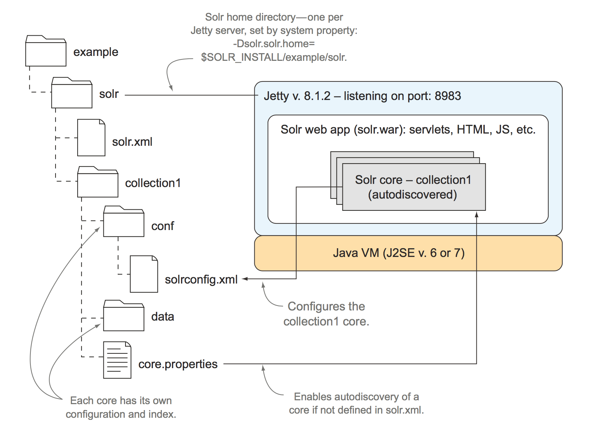

# 《Solr实战》读书笔记


## 4.配置 Solr

##### 主要配置文件

`Solr` 大部分配置都存在于以下三个文件中：

- `solr.xml` ：定义管理、日志、文件、分片和 `SolrCloud` 的有关属性。
- `solrconfig.xml` ：定义 `Solr` 内核的主要配置。
- `schema.xml` ：定义索引结构，包括字段及其数据类型。

##### 目录基本说明



- `solr` 目录是根目录（ `solr.home` ）。
- `collection1` 目录是内核（ `core` ）目录（如果有多个内核，则应为多个目录）。
- 内核（ `core` ）目录中应存在 配置文件目录（ `conf` ）和 内核配置文件（ `core.properties` ）。
- `Solr` 启动后会自动发现和加载已经创建的内核（ `core` ）目录的内核。

##### core.properties 文件说明

> core.properties 配置中可以配置如下参数

参数|说明
-|-
`name`|内核：必备
`config`|指定配置文件名称：默认为 `solrconfig.xml`
`dataDir`|存放索引文件和更新日志（ `tlog` ）的目录路径：默认为实例目录下的 `data` 目录
`ulogDir`|存放更新日志（ `tlog` ）的路径
`schema`|指定字段配置文件名称：默认为 `schema.xml`
`shard`|设置分片（ `shard` ）ID
`collection`|设置 `SolrCloud` 集合的名称
`loadInStartup`|若为真，在 `Solr` 初始化的过程中加载该内核，为该内核开启一个新的搜索器
`transient`| 若达到 `Solr` 的 `transientCacheSize` 阈值，该内核可以自动不加载

### 4.1 solrconfig.xml 文件概览

```xml
<!-- solrconfig.xml -->
<config>
  <!-- Lucene 激活版本相关功能 -->
  <luceneMatchVersion>4.7</luceneMatchVersion>

  <!-- Lib 目录存放 Solr 的扩展 JAR 文件 -->
  <lib dir="../../../contrib/extraction/lib" regex=".*\.jar" />

  <!-- 索引管理配置 -->
  <dataDir>${solr.data.dir:}</dataDir>
  <directoryFactory name="DirectoryFactory" class="..."/>
  <indexConfig> ... </indexConfig>
  <!-- /索引管理配置 -->

  <!-- 启用 Solr Mbeans 的 JMX 工具 -->
  <jmx />

  <!-- 索引文档的更新处理器 -->
  <updateHandler class="solr.DirectUpdateHandler2">
    <updateLog> ... </updateLog>
    <autoCommit> ... </autoCommit>
  </updateHandler>
  <!-- /索引文档的更新处理器 -->

  <!-- 搜索器事件的事件注册处理器。例如：预热新搜索器的查询执行 -->
  <query>
    <filterCache ... />
    <queryResultCache ... />
    <documentCache ... />
    <listener event="newSearcher" class="solr.QuerySenderListener">
      <arr name="queries"> ... </arr>
    </listener>
    <listener event="firstSearcher" class="solr.QuerySenderListener">
      <arr name="queries"> ... </arr>
    </listener>
  </query>
  <!-- /搜索器事件的事件注册处理器 -->

  <!-- 统一请求分发器 -->
  <requestDispatcher handleSelect="false" >
    <requestParsers ... />
    <httpCaching never304="true" />
  </requestDispatcher>
  <!-- /统一请求分发器 -->

  <!-- 请求处理器使用搜索组件链处理查询 -->
  <requestHandler name="/select" class="solr.SearchHandler">
    <lst name="defaults"> ... </lst>
    <lst name="appends"> ... </lst>
    <lst name="invariants"> ... </lst>
    <arr name="components"> ... </arr>
    <arr name="last-components"> ... </arr>
  </requestHandler>
  <searchComponent name="spellcheck" class="solr.SpellCheckComponent"> ... </searchComponent>
  <!-- /请求处理器使用搜索组件链处理查询 -->

  <!-- 使用更新请求处理扩展索引行为。例如：语种检测 -->
  <updateRequestProcessorChain name="langid"> ... </updateRequestProcessorChain>

  <!-- 搜索结果格式为 JSON -->
  <queryResponseWriter name="json" class="solr.JSONResponseWriter"> ... </queryResponseWriter>

  <!-- 为提升排名或者排序文档，声明一个自定义函数 -->
  <valueSourceParser name="myfunc" ... />

  <!-- 对搜索结果文档进行转换 -->
  <transformer name="db" class="com.mycompany.LoadFromDatabaseTransformer">
    ...
  </transformer>
  <!-- /对搜索结果文档进行转换 -->
</config>
```

#### 4.1.1 常见的 XML 数据结构和数据类型元素


## 12.搭建Solr生产环境

### 12.3 硬件配置和服务器配置

#### 12.3.1 内存和固态硬盘

- `Solr`进行`分面`、`排序`、`索引文档`和`查询请求缓存`时会消耗大量内存。
- `Solr`索引能否完全载入当前服务器 **未分配** 给`JVM`的可用内存空间中。
- 在查询性能优化时，保证所有索引都能加载到内存中 比 使用`SSD`更好。
- 在索引性能优化时，替换`SSD`为更好的选择。

#### 12.3.2 JVM设置

- `JVM`内存空间只用来 存储核心数据结构（`缓存："主要由字段缓存、过滤器缓存、历史查询缓存组成"`、`Solr内核`和`其他内存数据结构`）和 执行查询操作。
- **必须不能分配太多的内存给JVM**，因为需要留下更多的系统内存用来存储索引数据。
- 如果要求在大多数时间里`Solr`都能达到最佳性能，并且允许某段时间长期地暂停服务（无响应），那么可以选择`吞吐垃圾回收器（Throughput Garbage Collector）`。
- 如果追求的是长时间稳定的性能，可以使用`并发标记清楚回收器（Concurrent Marksweep Garbage Collector）`。

> 添加 `Solr5` 默认 `JVM` 配置。


#### 12.3.3 索引切换

##### 增量索引

- 索引创建遵循`增量索引`原则，即总是将修改添加到新文档中，而不添加到之前已写入文档中。
- `硬提交`操作会启动一个`新的搜索器`，`新的搜索器`会创建新的`索引（旧的索引块 + 新增的索引块）`。

##### 索引切换和缓存预热

- 在每一次提交时，`Solr`会`预热缓存（JVM中的缓存）`，即从`旧的搜索器`中将`缓存（JVM缓存包括：历史查询、过滤器、字段值等）`移动至`新的搜索器`中。

```xml
<!-- solrconfig.xml -->
<!-- 缓存越大，提交（commit）时间越久（因为新的 searcher 预热时间会越久）。 -->
<fieldValueCache class="solr.FastLRUCache" size="512" autowarmCount="128" showItems="32" />
<filterCache class="solr.FastLRUCache" size="20480" initialSize="20480" autowarmCount="4096" />
<queryResultCache class="solr.LRUCache" size="20480" initialSize="20480" autowarmCount="4096"/>
<documentCache class="solr.LRUCache" size="20480" initialSize="20480" autowarmCount="4096" />
```

- `缓存`的大小越大，则`新搜索器`需要预热的时间就越久，创建索引的时间越长。
- `autowarmCount`值越高，创建索引时间越久（在对于`filterCache`配置中，如果有许多非常耗资源的过滤器，可能需要数分钟甚至是数小时才能完成一个新搜索器的预热）
- `autowarmCount`值过低，可能会对新搜索器的初始性能产生负面影响。

##### 索引块合并与优化

- 合并策略取决于`合并调度器（Merge Scheduler）`和`合并策略（Merge Policy）`决定何时以及如何合并索引。
- `mergeFactor`的值（或者`maxMergeAtOnce`和`segmentsPerTier`的值）越大则索引效率越高。
- `mergeFactor`的值（或者`maxMergeAtOnce`和`segmentsPerTier`的值）越小则检索效率越高。
- `optimize`在索引不再发生变化的时候使用。
- `optimize`时需要更多的系统资源（需要2倍的当前索引存储空间）。

#### 12.3.4 实用Solr系统配置技巧

##### 在启动前将索引加载到非JVM分配内存中

> **注意：** 在Solr未启用时并且系统内存大于Solr索引存储量时使用。

```bash
> find ${SOLR_INSTALL}/example/solr/*/data/ -type f -exec cat {} \; > /dev/null
```

##### 增加可用的文件描述符

- `操作系统` 会限制同时打开文件数。所以 `Solr` 使用相对于最大文件描述符数量表示，可在监控页面中查看。


> 若文件描述符数量已使用满，则 `Solr` 很有可能会崩溃。可以使用下面的命令修改系统限制，已解决该问题。

```bash
# 解决 Solr 文件描述符使用满问题
> ulimit -n 100000
```

### 12.4 数据获取策略

##### 文档格式、索引时间和批量更新

- 向`Solr`直接发送二进制格式的文档，可以减少创建索引时的序列化时间。
- 创建索引解析`XML`文件会消耗更多的资源，使用二进制或者`CSV`格式等易于解析的文档输入格式会在很大程度上减少索引时间。
- 索引过程一个最大的性能瓶颈是从外部数据库中加载内容，并将它转化为`Solr`的文档。

##### 利用 Solr Cell 从非文本文档中抽取文本数据

- 可以使用`Solr Cell`从`PDF, Word, Excel, PowerPoint, 图像`等其他常见格式中抽取文本。
- 可以在`Solr Cell`的Wiki页面中查看介绍。（ https://wiki.apache.org/solr/ExtractingRequestHandler ）

### 12.5 分片和复制

#### 12.5.1 分片策略

##### 文档总数

- 由于底层`lucene`的限制，`Solr`中限制了每个索引最大包含`2的31次方 (约21亿)`个文档。

### 12.6 Solr 内核管理

##### 创建内核

> **注意：** 如果在`solr.xml`文件设置了`persist=false`则`Solr`重启以后所有内核都不会存在。

```bash
# 创建内核 API
http://locahost:8983/solr/admin/cores?
  action=CREATE&
  name=coreX&
  instanceDir=path_to_instance_directory&
  config=solrconfig_file_name.xml&
  schema=schema_file_name.xml&
  dataDir=data&
  loadOnStartup=true& # true|false 开启或关闭 延迟加载（或卸载）Solr 内核
  transient=false # true|false 开启或关闭内核的卸载
```

##### 重载内核

> Solr 内核重载过程中，所有缓存和请求处理器的统计数据都将丢失。

```bash
# 重载内核 API
http://locahost:8983/solr/admin/cores?
  action=RELOAD&
  core=coreX
```

##### 重命名和置换内核

```bash
# 重命名和置换内核
http://locahost:8983/solr/admin/cores?
  action=SWAP&
  core=coreX&
  other=coreX_new
```

##### 卸载和删除内核

```bash
# 卸载和删除内核
http://locahost:8983/solr/admin/cores?
  action=UNLOAD&
  core=coreX_old&
  deleteInstanceDir=false&
  deleteDataDir=false&
  deleteIndex=false
```

##### 切分和合并索引

```bash
# 切分索引（拆分到新的内核中）
http://locahost:8983/solr/admin/cores?
  action=SPLIT&
  core=oldCore&
  targetCore=newCore1&
  targetCore=newCore2&
  targetCore=newCore3

# 切分索引（拆分到新的目录中，拆分后会启动内核，不推荐）
http://locahost:8983/solr/admin/cores?
  action=SPLIT&
  core=oldCore&
  path=/path/to/newCore1/data/&
  path=/path/to/newCore2/data/&
  path=/path/to/newCore3/data/

# 合并索引（合并到新的内核中）
http://locahost:8983/solr/admin/cores?
  action=MERGEINDEXS&
  core=newCore&
  srcCore=oldCore1&
  srcCore=oldCore2&
  srcCore=oldCore3

# 合并索引（合并到新的目录中）
http://locahost:8983/solr/admin/cores?
  action=MERGEINDEXS&
  core=newCore&
  indexDir=/path/to/oldCore1/data/&
  indexDir=/path/to/oldCore2/data/&
  indexDir=/path/to/oldCore3/data/
```

##### 获取内核状态信息

```bash
# 获取内核状态信息
http://locahost:8983/solr/admin/cores?
  action=STATUS
```

### 12.8 Solr 的查询与交互

#### 12.8.3 SolrJ

##### 使用 SolrJ 通过 HTTP 连接 Solr 服务器

SolrServer 实现 | 说明
-|-
**`HttpSolrServer`** | 默认的 `SolrServer` 用于与 `Solr` 的端对端请求。
**`ConcurrentUpdateSolrServer`** | 用于发送 `更新/删除` 请求，按序列进行文档更新的批处理，以提高索引吞吐量。
**`LBHttpSolrServer`** | 启用跨 `Solr` 端点的请求负载平衡。
**`CloudSolrServer`** | 通过 `Solr` 端点的 `Zookeeper` 动态发现实现跨 `SolrCloud` 集群的负载平衡。
**`EmbeddedSolrServer`** | 以嵌入模式在当前系统中使用 `Solr` ，无需启用 `HTTP` 访问。

##### 利用 SolrJ 将 Solr 嵌入应用程序中

```java
// 使用 EmbeddedSolrServer 完成 嵌入式 的使用 Solr，不走 HTTP。
File home = new File( "/path/to/solr/home" );
File file = new File( home, "solr.xml" );
CoreContainer container = new CoreContainer();
container.load( "/path/to/solr/home", file );
EmbeddedSolrServer server = new EmbeddedSolrServer(
     container, "core1" );
SolrQuery query = new SolrQuery();
     query.setQuery( "*:*" );
...
QueryResponse rsp = server.query( query );
SolrDocumentList docs = rsp.getResults();
```

##### SolrJ 版本和序列化

```java
// 将默认的传输格式从 XML 改为 Java 二进制格式，这将会大大地降低与 Solr 请求相关的 序列化/去序列化 的成本。
SolrServer server = new
  HttpSolrServer("http://localhost:8983/solr/collection1");
  server.setParser(new BinaryResponseParser());
  server.setRequestWriter(new BinaryRequestWriter());
```

## 13. SolrCloud

### 13.1 SolrCloud 上手

#### 13.1.1 启动 SolrCloud

##### 启动 SolrCloud

```bash
# 启动 SolrCloud 命令
> java -Dcollection.configName=logmill # Zookeeper 中存储 SolrCloud 的目录名称
       -DzkRun
       -DnumShards=2 # 2个分片
       -Dbootstrap_confdir=./solr/logmill/conf # 上传到 Zookeeper 的配置文件目录
       -jar start.jar
```

##### 启动另外一个 Shard 节点

```bash
# 启动另外一个 Shard 节点
> java -DzkHost=localhost:9983 # 指定 Zookeeper 地址
       -Djetty.port=8984
       -jar start.jar
```

（补充启动结果图示）

##### SolrCloud 下的分布式查询

- `SolrCloud` 创建索引时，会根据文档的ID的哈希值将其发送到其中的一个分片上。
- 每个分片占用独有的 `散列区间` ， `散列函数` 会试图在分片之间将各个文档进行均匀分配。
- 查询时添加参数 `distrib=false` 则只查询当前节点的索引。

#### 13.1.2 SolrCloud 架构的驱动因素

##### 可扩展性

- `纵向扩展` 包括增加单个服务器的计算资源，如增加内存、增加更快的CPU，以及使用固态硬盘提升磁盘I/O性能等。
- `横向扩展` 包括在系统里添加更多节点，将工作负载分配到多台并行的服务器上。
- 数据举例：若有 `20GB` 的索引数据，则设置 `JVM` 内存为 `8GB` ，所以应准备 `28GB` 的内存空间给 `Solr` 使用。

##### 高可用性

- 由于硬件故障和断网这样的问题造成的意外中断，会影响集群里节点的子集。
- 由于系统升级和系统维护任务而发生的计划内中断停机。
- 由于系统负载较重，需要进行降级服务。
- 造成整个集群或者数据中心脱机的灾害性事故。（现不支持自动处理，需要手动处理）

##### 一致性

- `SolrCloud` 保证强一致性，即写操作必须在分片的所有处于激活状态的副本上执行成功，才算该操作执行成功。

##### 简单性

- 日常操作简单：一旦设置好之后，运行 `Solr集群` 不会比运行 `单个Solr实例` 复杂。
- 节点故障恢复很简单：一旦已经解决造成节点故障的问题，可以容易地并且自动地将节点重新添加回集群。已恢复的节点可以与所在分片的 `leader` 节点保持同步。

##### 灵活性

- `Solr` 支持将一个分片分解成较小分片的能力，并支持多分片分布查询。

### 13.2 核心概念

#### 13.2.1 集合 vs 内核

- `Solr` 管理 `内核` 。
- `SolrCloud` 管理 `集合` ，`集合` 管理多个 `分片` 。

#### 13.2.2 Zookeeper

`SolrCloud` 使用 `Zookeeper` 完成三个关键操作：

- 集中化配置存储和分发。
- 监测和提醒集群的状态改变。
- 确定分片 `leader` 。

##### Zookeeper 数据模型

- `Zookeeper` 将数据组织在类似于文件系统的层次命名空间里，层级中的每一级叫 `znode` 。
- `Zookeeper` 为每个 `znode` 预设了最大为 `1MB` 的可用存储空间。
- `Zookeeper` 的一个核心概念是 `临时（ephemeral）znode` ，它需要一个活动的客户端连接来保持 `znode` 一直活跃。
- 当一个 `Solr` 节点加入集群时，就在 `/live_nodes` 节点下面创建临时 `znode` 。
- 如果 `Solr` 崩溃了，于临时 `znode` 的连接就会自动断掉，导致系统认为该节点也消失了。当 `znode` 的状态改变时， `Zookeeper` 就会通知集群里的其他节点：其中一个节点出故障了，这样 `Solr` 就不会尝试向故障节点发送分布式查询请求。

##### Zookeeper 客户端超时

- 如果 `Zookeeper` 其中一个 `Solr` 节点崩溃， `Zookeeper` 在超时后会自动检测到节点的崩溃，默认为 `15s` 可以通过 `-DzkClientTimeout=30000` 将超时设置为 `30s` 。

> **完整垃圾回收（Full garbage collection）和 Zookeeper 客户端超时**
>
> 顺便提一句，要注意在 `Java` 虚拟机中的 完整垃圾回收 `(Full garbage collection)` 对于 `Zookeeper` 会话的影响。 `JVM` 在运行 完整垃圾回收 时会暂停所有正在执行的线程，包括保持 `Zookeeper` 会话活跃的线程。不难理解，如果一个 完整的垃圾回收 时间比 `Zookeeper` 客户端超时时间还长，那么实例就会显示成脱机状态。这是好事，因为实例在执行 完整垃圾回收 时是不能对请求做出响应的。一旦 完整垃圾回收 所引发的暂停终止， `Solr` 会尝试重新与 `Zookeeper` 建立连接。如果发现节点与 `Zookeeper` 之间的会话数量不断下降，建议启用详细的垃圾回收日志记录，查看是否是因为 完整垃圾回收 活动耗费的时间太长。如何启用详细的垃圾回收日志记录，请参考 `JVM` 的文档信息。

#### 13.2.4 集群状态管理

##### SolrCloud 状态

状态|描述
-|-
`活跃（Active）` | 活跃状态的节点能服务于查询和接受更新请求。活跃的副本能与分片 `代表（leader）` 保持 `同步（replication）` 。在良好状态的集群中，所有节点都处于活跃状态。
`恢复中（Recovering）` | 恢复实例正在运行时不能提供查询服务，不过在恢复过程中它们可以接受更新请求，为的是不至于落后分片 `代表（leader）` 太多。
`恢复失败（Recovery Failed）` | 实例试图恢复但是遇到错误，即为恢复失败状态。大多数情况下，需要查看日志，手动解决实例恢复时遇到的问题。
`故障（Down）` | 实例能运行，也连接到了 `Zookeeper` 上，但处于一种不能恢复的状态。例如， `Solr` 在进行初始化时发生故障。出了故障的实例不能参与查询和接受更新。通常故障状态都是暂时的，节点会很快转成其他状态。
`消失（Gone）` | 实例没有连接到 `Zookeeper` 上，而且有可能已经崩溃了。如果一个节点仍在运行，但是 `Zookeeper` 认为它已经消失了，那么最有可能的原因就是 `JVM` 中的 `OutOfMemoryError` 错误。

#### 13.2.5 确定分片 leader

**分片 `leader` 负责以下几项额外的更新请求，副本无法负责这些请求**

- 为分片接受更新请求。
- 在更新后的文档上增加 `_version_` 字段的值，并且强制执行 `乐观锁` 。
- 将文档写入更新日志。
- 以并行方式将更新请求发送给所有副并且加锁，直到收到响应。

> 开始时 `Solr` 使用 `Zookeeper` 的序列标志跟踪各节点注册顺序，作为 `选举顺序` 。序列会以原子方式递增， `序列号越小值（先注册的）` 则会成为分片 `leader` 。如果当前 `leader` 出现故障，则会选出一个 `状态良好` 且 `序列号越小` 的作为 `leader` 。


#### 13.2.6 SolrCloud 的重要配置

```xml
<!-- solr.xml 文件 -->
<solr>
  <solrcloud>
    <!--
      主机：该值会写到 Zookeeper 中，同时 `Zookeeper` 会通过该值访问具体主机，生产环境推荐使用主机名。
      设置为 ${host:} 以后，在启动时可以使用 -Dhost=solr1.example.com 参数设置该值。
    -->
    <str name="host">${host:}</str>
    <!--
      端口号：默认是 8983
      设置为 ${jetty.port:8983} 以后，在启动时可以使用 -Djetty.port=8983 参数设置该值。
    -->
    <int name="hostPort">${jetty.port:8983}</int>
    <!-- Solr 主机环境：如果更改 Solr 的网络应用程序或者把 solr.war 文件部署在 Jetty 的根目录下，就必须设置 hostContext 参数。 -->
    <str name="hostContext">${hostContext:solr}</str>
    <!-- 内核（Core）节点名称：如果设置为 false ，则内核的名称会包含 host 参数值，如 10.0.1.7:8983_Solr_logmill 。 -->
    <bool name="genericCoreNodeNames">${genericCoreNodeNames:true}</bool>
    <!-- Zookeeper 客户端连接超时时间，可以只用 -DzkClientTimeout=60000 参数设置该值。 -->
    <int name="zkClientTimeout">${zkClientTimeout:30000}</int>
    <int name="distribUpdateSoTimeout">${distribUpdateSoTimeout:600000}</int>
    <int name="distribUpdateConnTimeout">${distribUpdateConnTimeout:60000}</int>
  </solrcloud>

  [...]

</solr>
```

> 还有一个参数未包含在实例 `solr.xml` 文件中。在分片 `leader` 确定之前，这个参数控制一个节点等待其他节点投票担任分片 `leader` 的等待时长。 `leaderVoteWait` 参数为分片 `leader` 的选择提供了安全保障机制，以防止带有过期数据的节点自动成为 `leader` ，这让托管相同分片的其他节点也有机会投票成为代表。

#### 13.2.7 本章总结

- `SolrCloud` 使用 `集合（Collection）` 这个概念来描述跨多个 `Solr` 实例的索引分割。从分片的角度看待问题比从内核的角度要更好， `Solr` 的内核仅仅是实现上的细节问题。
- `Zookeeper` 是 `SolrCloud` 的一项关键性服务，它提供了集中化 `配置管理` 、`集群状态管理` 和 `确定分片代表（Shards Leader）` 。
- 当定义一个集合时，必须指定分片数量。数量的确定可以基于文件数量、文件大小、索引吞度量、查询复杂性以及随着时间增长的索引大小。
- 监督组件会更新 `/clusterstate.json znode 节点` ，以便集群状态有所改变时能通知其他所有节点。
- 在创建索引时， `分片代表（Shards Leader）` 会承担一些额外工作，它的确定是由 `Zookeeper` 提供的方法自定选择的。
- 如果当前 `分片代表（Shards Leader）` 出了故障，系统会自动选择一个新的 `代表（leader）` 。

### 13.3 分布式索引

> `SolrCloud` 中分布式索引总体目标：
>
> - 能够将文档发送到集群的任何节点上，并且使文档能在正确的分片中索引。
> - 去除所有的 `单点故障（Single Point Of Failure, SPOF）` ，这是达到 `高可用性` 所不可或缺的。

#### 13.3.1 将文档分配给分片

- `SolrCloud` 使用 `文档路由（document router）` ，支持两种基本的文档路由策略： `compositeID（默认）` 和 `implicit（隐式路由）` 。
- 在默认文档路由策略（ `compositeID` ）时，使用了 `MurmurHash算法` 作为文档要配到哪个分片的 `哈希算法` 。因为两点：1. 该算法足够快。2. 该算法分配的足够平均。

#### 13.3.2 添加文档


##### 第一步 使用 CloudSolrServer 发送更新请求

`CloudSolrServer` 首先连接到 `Zookeeper` 上为了获取集群的当前状态。这意味着， `索引客户端` 知道集群中每一个节点的状态以及哪些节点是 `leader` 。获取到当前集群状态有以下两个好处：

- `索引客户端` 可以直接将要创建的索引文档发送给各个分片的 `leader` 节点。
- `索引客户端` 它能够提供基本的 `负载均衡` 和 `重试逻辑` 。如果客户端正在创建索引时，一个节点崩溃了，那么 `CloudSolrServer` 会从 `Zookeeper` 那里得到通知；如果该节点是 `leader` 节点，那么 `CloudSolrServer` 会收到选择新的 `分片代表（Shards Leader）` 的通知。

##### 第二步 将文档分配给正确的分片（Shard）

`CloudSolrServer` 需要使用 `文档路由（document router）` 进程来确定将文档发送到哪一个分片上。从理论上讲，单个文档的创建过程非常简单。但是，如果在索引应用中将多个文档添加到 `CloudSolrServer` 里一起创建，那么 `CloudSolrServer` 会将该批次分解成为 `S` 个子批次，这里的 `S` 是 `分片数量（Shard Number）` 。然后 `CloudSolrServer` 使用 `文档路由（document router）` 将每个子批次分配到正确的分片上。

##### 第三步 代表（Leader）分配 版本号（Version ID）

在文档发送给 `副本（replica）` 之前，分片代表会在本地创建索引文档。这是为了在将文档转送给副本之前，使用 `更新日志（tlog）` 验证文档并确保文档是安全持久地存储在系统里。此外，代表会给每个新文档分配一个 `版本号（Version ID）` 。对于现存文档，代表会将文档的当前的版本号与版本号作对比，以支持第5章提到的 `乐观锁（optimistic locking）` 过程。

（了解第五章乐观锁）

##### 第四步 将请求转发给副本（Replica）

一旦文档通过验证并且分配给了版本号，代表就会决定哪些副本可用，并使用多线程并行将更新请求发送给每个副本。对于任何更新请求来说，都可能会有一些副本处于脱机或者宕机状态。代表在发送文件时并不关心此种情况，因为代表能够使用恢复进程对没有发送成功的文档进行恢复，参见 13.3.4 节。有一点可能不太明显，代表会将更新请求发送给那些还处在 `恢复状态（recovering status）` 的副本。处于恢复状态的节点会在恢复运行过程中将更新请求写在其 `更新事物日志（tlog）` 中。

（了解 13.3.4 节，恢复进程）

##### 第五步 确认写操作成功

一旦代表收到了来自于所有活跃和恢复进程中的副本的确认，它就会将确认返回给 `索引客户端` 应用程序。只要分片里还有一个活跃的副本， `SolrCloud` 就会持续接收 `创建/更新` 请求。然而，这种方法更偏向于写操作的可用性，虽然有可能会以失去一致性为代价。

##### 提交（Commit）

除非文档被提交，否则在搜索结果里是看不到它们的。在分布式索引中，当把提交请求发送给任何节点时，`SolrCloud` 会将提交请求转发给集群里的所有节点，以便顺利提交每个分片。

#### 13.3.3 近实时搜索

- `近实时搜索（NRT）` 的目的是使文档在被添加到索引之后的大约一秒钟以内就能出现在搜索结果中。
- `缓存自动预热设置` 和 `预热查询的执行速度 `必须必执行软提交的速度更快。

```xml
<!-- 打开软提交配置（solrconfig.xml） -->
<autoSoftCommit>
  <!-- 每 1000 毫秒发出后一个软提交 -->
  <maxTime>1000</maxTime>
</autoSoftCommit>
```

### 13.4 分布式搜索

> 使用 `distrib=false` 参数可以 `禁止` 分布式搜索（ 启用 `SolrCloud` 以后 `distrib` 参数默认为 `true` ）。

#### 13.4.1 多阶段查询流程


##### 第一步 客户端发送查询请求至任何节点

- 当客户端应用程序向集群里的任意节点发送查询请求时，分布式查询从这里开始。
- 比较常见的情况是，使用负载均衡器将查询请求分配到集群中的各个不同的节点上。
- 如果使用 `SolrJ` ，那么 `CloudSolrServer` 类就会充当一个简单的分配查询请求的负载均衡器。
- 如果没有使用 `SolrJ` ，可以使用专门的负载均衡器或者一些像循环 `DNS` 地址的简单方法访问集群。

##### 第二步 查询控制器接受请求

- 接收初始请求的节点是 `查询控制器（Query Controller）或者叫 聚合器（Aggregator）` ，它负责创建统一的结果集并返回客户端。
- 集群里的任何节点都能充当查询控制器。

##### 第三步 查询阶段

- `查询控制器（Query Controller）` 会给每一个 `分片（Shard）` 发送一个 `非分布式查询（distrib=false）` ，以确认匹配分片里的文档。
- 控制器能通过 `Zookeeper` 提供的集群信息来确定哪些节点参与查询。
- 分布式查询的响应速度是以最慢的分片查询速度为准。
- 查询完成时，只返回文档的 `id` 和 `score` 字段（如果查询参数中有返回其他字段的请求，那么 `SolrCloud` 会发送第二次请求获取已经查询到文档的其他字段）。
- 假设查询参数中设置 `rows=10` ，集群中有 `10个分片` ，那么查询控制器将会对返回的 `100个文档` 进行合并和排序。

##### 第四步 获取字段阶段

- 如果仅仅需要的是文档的 `ID` 号，就不需要获取额外字段的第二步查询了。
- 若还需要返回其他字段，那么 `查询控制器（Query Controller）` 会根据 `第一步（查询阶段）` 返回的结果，确定文档在哪些节点中。并向这些节点发送第二次获取字段的请求。
- 如果一个分片中没有一个活着的节点，那么查询会失败，但是通过设置 `shards.tolerant=true` 可以接受不完整的结果。

#### 13.4.2 分布式搜索的局限性

- 倒排文档频次（ `idf` ）仅基于本地索引中的词频。在计算文件权重时会用到 `idf` ，因此在分布式查询中对文档进行排序时，会有一些偏差。默认情况下，文档是被随机分配在各个分片上的，在 `shard1` 中一个词的 `idf` 与所有分片中一个词的 `idf` 会接近。
- 除非使用 `13.7.1` 节介绍的自定义散列解决办法，否则 `连接（join）` 在分布式模式之下不起作用。
- 为了在 `SolrCloud` 中使用 `Solr` 的分组功能，需要使用自定义散列去分配那些会被分到同组的文档。

### 13.6 基本系统管理任务

#### 13.6.1 配置更新

##### 第一步 将更新上传至 Zookeeper 中

```bash
> cd $SOLR_INSTALL/shard1/cloud-scripts
> ./zkcli.sh -zkhost localhost:9983 -cmd upconfig -confname logmill -confdir ../solr/logmill/conf
```

##### 第二步 重新加载集合

使用集合API完成：http://localhost:8983/solr/admin/collections?action=RELOAD&name=logmill ，该操作代价很高，通常应在维护时进行此操作。

#### 13.6.2 滚动重启

若更改 `JVM` 配置不得不需要重启节点时，可以使用 `滚动重启` 即每次只重启一个节点，并当该节点已经成功启动后，再重启下一个节点。以保证整个集群在重启过程中始终可以提供服务。

### 13.7 高级主题

#### 13.7.1 自定义散列

（需补充）

#### 13.7.2 分片分割

- 使用集合 `API` 的 `SPLITSHARD` 操作将现有的分片分割成两个子分片。
- 在分片分割完成后使用硬提交激活新的子分片。
- 从集群中卸载原来的分片 或者 将其中一个拆分迁移到新的服务器上。

## 参数说明

### 索引块合并与优化

```xml
<!-- solrconfig.xml -->
<!-- 若TieredMergePolicy没有被单独设置，则该值为mergeFactor的值（默认值也为10） --->
<mergePolicy class="org.apache.lucene.index.TieredMergePolicy">
  <!--  决定了一次最多有多少索引块可以被合并到新索引块中，默认情况下，这两者的值都被设为10。-->
  <int name="maxMergeAtOnce">10</int>
  <!--  决定了在solr开始合并索引块之前，可以创建多少个索引块。 -->
  <int name="segmentsPerTier">10</int>
</mergePolicy>

<!--
  该值或者（maxMergeAtOnce和segmentsPerTier）值越大，增创建索引的速度越快。
  推荐/默认值为10.
-->
<mergeFactor>10</mergeFactor>

<!-- solr根据上述规则完成索引块合并时，会将其中的旧数据（已删除的数据）清除，从而释放存储空间。 -->
```
