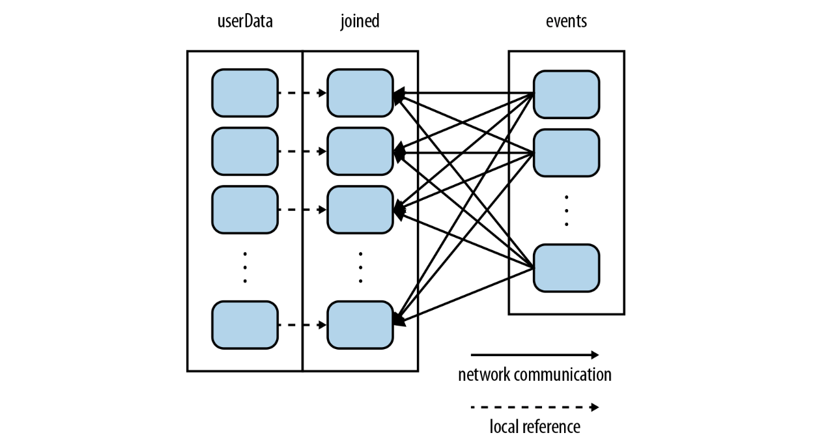

# 《Spark 快速大数据分析》读书笔记


## 第3章 RDD 编程

### 3.1 RDD 基础

> **在任何时候都可以进行重算是我们为什么把 `RDD` 描述为 `弹性` 的原因。** 当保存 `RDD` 数据的一台机器失败时， `Spark` 还可以以这种特性来重算出已经丢失的分区，这一过程对用户是完全透明的。
/.

- `Spark` 的 `RDD` 是一个 不可变的分布式对象集合。
- 每个 `RDD` 有多个分区，这些分区分布在集群中的不同节点上。
- `RDD` 有两种类型的操作： `Transformation` 和 `Action` 。
- `Transformation` 操作会把一个 `RDD` 转化成为一个新的 `RDD` 。
- `Action` 操作会通过 `RDD` 计算出一个结果，返回给 `Driver` 或者 把结构存储到外部的存储系统中。


### 3.2 创建 RDD

> 创建 `RDD` 有两种方法。

##### 读取外部数据集

```python
# 读取外部数据集创建 RDD
>>> lines = sc.textFile("/path/to/README.md")
```

##### 调用 parallelize() 函数

```python
# 调用 parallelize() 函数创建 RDD
>>> lines = sc.parallelize(["pandas", "i like pandas"])
```

### 3.3 RDD 操作

#### 3.3.1 转化（Transformation）

- 转化（Transformation）操作是将一个 `RDD` 转化成另一个（新的）`RDD` ，而不是改变了原来的 `RDD` 。因为 `RDD` 是不可变的。
- `旧 RDD` 和 `新 RDD` 的关系被称为 `依赖（Dependencies）`。

#### 3.3.2 行动（Ation）

- `collect()` 函数不能用在大规模数据集上，当存在大规模数据集应将它们写到外部存储系统中。
- 每当调用一次 `Action` 操作时，`RDD` 都会从头开始算一次，好的做法是将中间结果持久化（ `persist() / cache()` ）。

#### 3.3.3 Lazy

- 所有的 `Transformation` 操作的都是 `Lazy` 的，即直到出现 `Action` 操作才会真正执行。这样做的好处是没有多余的中间结果，和更全面的优化。
- `Lazy` 是 `Spark` 比 `Hadoop` 快的主要特点之一。

### 3.4 向 Spark 传递函数

##### 错误样例

> 不要向 `Spark` 传递带有引用的函数，因为会将引用的所有内容都一并传递（有可能很大）。

```python
# 错误样例
class SearchFunctions(object):

    def __init__(self, query):
        self.query = query

    def isMatch(self, s):
        return self.query in s

    def getMatchesFunctionReference(self, rdd):
        # 问题：在 self.isMatch 中引用了整个 self。
        rdd.filter(self.isMatch)

    def getMatchesMemberReference(self, rdd):
        # 问题：在 self.query 中引用了整个 self。
        rdd.filter(lambda x: self.query in x)
```

##### 正确样例

> 解决方法，将需要传递的内容拿出来到一个局部变量中，再传递这个局部变量。

```python
# 正确样例
class WordFunctions(object):

    # ...

    def getMatchesNoReference(self, rdd):
        # 安全：只要把需要的字段提取到局部变量中。
        query = self.query
        return rdd.filter(lambda x: query in x)
```

### 3.6 持久化（缓存）

> 在 `org.apache.spark.storage.StorageLevel` 和 `pyspark.StorageLevel` 文件中描述了 `持久化级别` ，如果需要可以在 `持久化级别` 的末尾加上 `_2` 用来把持久化数据存储 `2` 份（如：`DISK_ONLY_2`）。

级别|使用空间|CPU时间|是否在内存中|是否在磁盘上|说明
-|-|-|-|-|-
`MEMORY_ONLY`|高|低|是|否|-
`MEMORY_ONLY_SER`|低|高|是|否|-
`MEMORY_AND_DISK`|高|中等|部分|部分|如果数据在内存中放不下，则溢写到磁盘上
`MEMORY_AND_DISK_SER`|低|高|部分|部分|如果数据在内存中放不下，则溢写到磁盘上。在内存中存放序列化后的数据
`DISK_ONLY`|低|高|否|是|-

> 如果要缓存的数据太多，内存放不下， `Spark` 会通过 `最近最少使用（LRU）` 策略把最老的分区从内存中移除。
>
> - 对于 `MEMORY_ONLY` 级别的缓存则直接被移除，若下次要访问则重新计算。
> - 对于 `MEMORY_AND_DISK` 级别的缓存则原存储在内存部分的缓存会被移动到磁盘上。

## 第4章 键值对操作

### 4.5 数据分区（进阶）

##### 场景

> 举个简单的例子，我们分析这样一个应用，它在内存中保存着一张很大的用户信息表--也就是一个由 `(UserID, UserInfo)` 对组成的 `RDD` ，其中 `UserInfo` 包含一个该用户所订阅的主题的列表。该应用会周期性地将这张表与一个小文件进行组合，这个小文件中存着过去五分钟内发生的事件--其实就是一个由 `(UserID, LinkInfo)` 对组成的表，存放着过去五分钟内某网站各用户的访问情况。

##### 需求

> 我们可能需要对用户访问其未订阅主题页面的情况进行统计。

##### 思路

> 我们可以使用 `Spark` 的 `join()` 操作来实现这个组合操作，其中需要把 `UserInfo` 和 `LinkInfo` 的有序对根据 `UserID` 进行分组。

##### 简单实现（未优化）

```scala
// 初始化代码，从 HDFS 上的一个 Hadoop SequenceFile 中读取用户信息
// userData 中的元素会根绝它们被读取时的来源（HDFS块所在的节点）来分布
// Spark 此时无法获知某个特定的 UserID 对应的记录位于哪个节点上
val sc = new SparkContext(...)
val userData = sc.sequenceFile[UserID, UserInfo]("hdfs://...").persist()

// 周期性调用函数来处理过去五分钟产生的事件日志
// 假设这是一个包含 (UserID, LinkInfo) 对的 SequenceFile
def processNewLogs(logFileName: String) {
    val events = sc.sequenceFile[UserID, LinkInfo](logFileName)
    val joined = userData.join(events) // RDD 键值对 (UserID, (UserInfo, LinkInfo))
    val offTopicVisits = joined.filter {
        case (userId, (userInfo, linkInfo)) =>
            !userInfo.topics.contains(linkInfo.topic)
    }.count()
    println("Number of visits to non-subscribed topics: " + offTopicVisits)
}
```

##### 分析

> 这段代码可以正确运行，但是不够高效。这是因为在每次调用 `processNewLogs()` 时都会用到 `join()` 操作，而我们对数据集是如何分区的却一无所知。默认情况下，连接操作会将两个数据集中的所有键的哈希值都求出来，将该哈希值相同的记录通过网络传到同一台机器上，然后在那台机器上对所有键相同额记录进行连接操作。因为 `userData` 表比每五分钟出现的访问日志表 `events` 要大得多，所以要浪费时间做很多额外工作：在每次调用时都对 `userData` 表进行哈希值计算和跨节点数据 `混洗（shuffled）` ，虽然这些数据从来都不会变化。


##### 进阶分析

> 要解决这一问题也很简单：在程序开始时，对 `userData` 表使用 `partitionBy()` 转化操作，将这张表转为哈希分区。可以通过向 `partitionBy` 传递一个 `spark.HashPartitioner` 对象来实现该操作。

##### 进阶实现（设置分区）

```scala
val sc = new SparkContext(...)
val userData = sc.sequenceFile[UserID, UserInfo]("hdfs://...")
                 .partitionBy(new HashPartitioner(100)) // 创建100个分区
                 .persist()

[...] // 与之前的 processNewLogs() 代码相同
```

##### 优化说明

> `processNewLogs()` 方法可以保持不变是因为在 `processNewLogs()` 方法中，`events RDD` 是本地变量，只在该方法中使用了一次，所以为 `events` 指定分区方式没有什么用处。由于构建 `userData` 时调用了 `partitionBy()` 方法。`Spark` 就知道了该 `RDD` 是根据键的哈希值来分区的，这样在调用 `join()` 时，`Spark` 就会利用到这一点。具体来说，当调用 `userData.join(events)` 时，`Spark` 只会对 `events` 进行数据混洗操作，将 `events` 中特定的 `UserID` 额记录发送到 `userData` 额对应分区所在的那台机器上。这样，需要通过网络传输的护具就大大的减少了，程序运行速度也可以显著提升了。



> 此外，传给 `partitionBy()` 的 `100` 表示 `分区数目` ，它会控制之后对这个 `RDD` 进行进一步操作（比如连接操作）时的 `任务并行度` 。
>
> **总的来说：这个值至少应该和集群中的 总核数 一致。**

（需要补充真实验证效果）

#### 4.5.2 从分区中获益的操作

对于像 `reduceByKey()` 这样的只做作用于单个 `RDD` 的操作，运行在未分区的 `RDD` 上的时候回导致每个键的所有对应值都在每台机器上进行 `本地计算`，只需要把本地最终计算出的结果值从各个工作节点传回主节点就可以了，所以说对于网络的开销不算大。

而对于诸如 `cogroup()` 和 `join()` 这样的 `二元操作` 来说，预先进行数据分区会导致其中至少一个 `RDD` 不会发生 `数据混洗（shuffled）`。如果两个 `RDD` 使用相同的分区方式，并且他们还缓存在同样的机器上（比如一个 `RDD` 是通过 `mapValues()` 从另一个 `RDD` 中创建出来的，这两个 `RDD` 就会拥有相同的键和分区方式），或者其中一个 `RDD` 还没有被计算出来，那么跨节点的 `数据混洗（shuffled）` 就不会发生了。

#### 4.5.3 影响分区方式的操作

- `Spark` 内部知道个操作会如何影响分区方式，并将会对数据进行分区的操作的结果 `RDD` 自动设置为对应的分区器。
- `转化（Transformation）` 操作的结果并不一定会按照已知的分区方式分区，这时输出的 `RDD` 可能就会没有设置分区器。例如，`map()` 操作可能会改变键值，从而导致分区方式改变。不过 `Spark` 提供了 `mapValues() 和 flatMapValues()` ，它们可以保证每个二元组的键（分区）保持不变。
- 对于二元操作，输出数据的分区方式取决于父 `RDD` 的分区方式。默认情况下会采用 `哈希分区（HashPartitioner）`，如果两个父 `RDD` 都设置过分区方式的话，结果 `RDD` 会采用第一个父 `RDD` 的分区方式。

#### 4.5.4 示例：PageRank

##### 介绍

> `PageRank` 算法是以 `Google` 的 `Larry Page` 的名字命名的，用来根据外部文档指向一个文档的链接，对集合中每个文档的重要程度赋予一个度量值。该算法可以用于对网页进行排序。当然，也可以用于排序科技文章或者社交网络中有影响的用户。

##### 数据结构

> `PageRank` 是执行多次连接的一个迭代算法，因此它是 `RDD` 分区操作的一个很好的用例。算法会维护两个数据集：
>
> - 一个由 `(pageID, linkList)` 的元素组成，包含每个页面的相邻页面的列表。
> - 另一个由 `(pageID, rank)` 元素组成，包含每个页面的当前排序值。

##### 算法逻辑

1. 将每个页面的排序值初始化为 `1.0`
2. 在每次迭代中，对页面 `p` ，向其每个相邻页面（有直接链接的页面）发送一个值为 `rank(p)/numNeighbors(p)` 的贡献值。
3. 将每个页面的排序值设置为 `0.15 + 0.85 * contributionsReceived`。

> 最后两步会重复几个循环，在此过程中，算法会逐渐收敛于每个页面的实际 `PageRank` 值。在实际操作中，收敛通常需要大约 `10` 轮迭代。

##### 算法实现

```scala
// 假设相邻页面列表以 Spark objectFile 的形式存储
// links => (pageID, linkList)
val links = sc.objectFile[(String, Seq[String])]("links")
              .partitionBy(new HashPartitioner(100))
              .persist()

// 将每个页面的排序值初始化为 1.0;
// 由于使用 mapValues() 所以生成的 ranks(RDD) 的分区方式和 links(RDD) 一致。
// ranks => (pageID, rank)
var ranks = links.mapValues(v => 1.0)

// 进行 10 轮迭代
for (i <- 0 until 10) {
    // links.join(ranks) => (pageID, (linkList, rank))
    val contributions = links.join(ranks).flatMap {
        case (pageId, (links, rank)) => links.map(dest => (dest, rank / links.size))
    }

    ranks = contributions.reduceByKey((x, y) => x + y).mapValues(v => 0.15 + 0.85 * v)
}

// 输出最终结果
ranks.saveAsTextFile("ranks")
```

##### 程序优化思路

1. `links(RDD)` 在每次迭代中都会和 ranks(RDD) 发生 `join()` 操作。由于 `links(RDD)` 是一个静态数据集，所以我们在程序的一开始就对它进行了分区操作，这样就不需要进行 `数据混洗（shuffled）`。实际上，`links(RDD)` 的大小会比 `ranks(RDD)` 大很多，毕竟它包含每个页面的相邻页面列表（由页面 `ID` 组成），而不仅仅是一个 `Double` 值，因此这一优化相比 `PageRank` 的 `MapReduce` 实现节约了相当可观的网络通信开销。
2. 出于同样的原因，我们将 `links(RDD)` 进行 `persist()` 操作，将它保留在内存中以供每次迭代使用。
3. 当我们第一次创建 `ranks(RDD)` 时，我们使用了 `mapValues()` 方法而不是 `map()` 方法，目的是用来保留父 `RDD` 的分区方式，这样对它进行的第一次 `join()` 操作就会开销很小。
4. 在循环体中，我们在 `reduceByKey()` 后使用了 `mapValues()`，是因为 `reduceByKey()` 的结果已经是哈希分区的了，这样一来，下一次循环中将映射操作的结果（`ranks(RDD)`）再次与 `links(RDD)` 进行 `join()` 操作的时候就会更加高效。

> 为了最大化分区相关优化的潜在作用，你应该在无需改变元素的键时尽量使用 `mapValues()` 或 `flatMapValues()` 操作。

#### 4.5.5 自定义分区方式

> 虽然 `Spark` 提供的 `HashPartitioner` 和 `RangePartitioner` 已经能够满足大多数用例，但是 `Spark` 还是允许你通过提供一个自定义的 `Partitioner` 对象来控制 `RDD` 的分区方式。这可以让你利用领域知识进一步减少通信开销。

##### 场景

> 假设我们要在一个网页的集合上运行前一节中的 `PageRank` 算法。但是在这里，每个页面的 `ID` 是页面的 `URL`（存储类型由 `数字` 变成了 `字符串`）。

##### 分析

> 当我们使用简单的 `哈希分区（HashPartitioner）` 时，拥有相似的 `URL` 页面（比如：`http://www.cnn.com/WORLD` 和 `http://www.cnn.com/US`）就可能会被分到完全不同的节点上。然而，我们知道在同一个域名下的网页更有可能相互链接。由于 `PageRank` 需要在每次迭代中从每个页面向他所有的相邻的页面发送一条消息，因此把这些页面分组到同一个分区中会更好。所以这里就可以使用自定义分区来实现仅根据域名而不是整个 `URL` 来分区的逻辑。

##### 说明

要实现自定义分区，你需要继承 `org.apache.spark.Partitioner` 类并实现下面三个方法：

- `numPartitions: Int` ：用来返回创建出来的分区数。
- `getPartition(key: Any): Int` ：用来返回给定键的分区编号（`0 到 numPartitions - 1`）。
- `equals()` ：`Java` 判断相等性的标准方法。这个方法的实现非常重要，`Spark` 需要用这个方法来检查你的分区器对象是否和其他分区器实例相同，这样 `Spark` 才可以判断两个 `RDD` 的分区方式是否相同。

> **注意：当你的算法依赖于 Java 的 hashCode() 方法时，这个方法有可能会返回负数。你需要十分谨慎，确保 getPartition() 方法永远返回一个非负数。**

##### Scala 算法实现

```scala
class DomainNamePartitioner(numParts: Int) extends Partitioner {
    // 重写 numPartitions 用来返回创建出来的分区数
    override def numPartitions: Int = numParts

    // 重写 getPartition() 用来返回给定键的分区编号
    override def getPartition(key: Any): Int = {
        val domain = new Java.net.URL(key.toString).getHost()
        val code = (domain.hashCode % numPartitions)
        if (code < 0) {
            code + numPartitions // 若是负数，使其变成正数
        } else {
            code
        }
    }

    // 重写 equals() 用来让 Spark 分区两个对象是不是有相同分区器对象
    override def equals(other: Any): Boolean = other match {
        case dnp: DomainNamePartitioner =>
            dnp.numPartitions == numPartitions
        case _ =>
            false
    }
}
```

> 需要使用时，只要把它传给 `partitionBy()` 方法即可。`Spark` 中有许多依赖于 `数据混洗（shuffled）` 的方法，比如 `join()` 和 `groupByKey()` ，它们都可以接收一个可选的 `Partitioner` 对象来控制输出数据的分区方式。

##### Python 算法实现

```python
import urlparse

def hash_domain(url):
    return hash(urlparse.urlparse(url).netloc)

rdd.partitionBy(20, hash_domain)  # 创建 20 个分区
```

> **注意：这里你所传过去的 哈希函数 会被与其他 RDD 的分区函数区分开来。如果你想要对多个 RDD 使用相同的分区方式的话，就应该使用同一个函数对象，比如一个全局函数，而不是为每个 RDD 创建一个新的算法相同的函数对象。**

## 第6章 Spark 编程进阶

### 6.1 简介

> `Spark` 中有两种类型的共享变量：`累加器（accumulator）` 和 `广播变量（broadcast variable）` 。

- `累加器（accumulator）` 用来对信息进行聚合。
- `广播变量（broadcast variable）` 用来高效分发较大的对象。

### 6.2 累加器

- 通过在驱动器中调用 `SparkContext.accmulator(initialValue)` 方法，创建出存有初始值的累加器。返回值为 `org.apache.spark.Accumulator[T]` 对象，其中 `T` 是初始值 `initialValue` 的类型。
- `Spark` 闭包里的执行器代码可以使用累加器的 `+=` 方法增加累加器的值。
- 驱动器程序可以调用累加器的 `value` 属性来访问累加器的值。

##### 示例：在 Python 中使用累加器进行错误计数

```python
# 创建用来验证呼号的累加器
validSignCount = sc.accumulator(0)
invalidSignCount = sc.accumulator(0)

# 验证算法
def validateSign(sign):
    # 定义全局变量
    global validSignCount, invalidSignCount

    # 验证
    if re.match(r"\A\d?[a-zA-Z]{1,2}\d{1,4}[a-zA-Z]{1,3}\Z", sign):
        validSignCount += 1
        return True
    else:
        invalidSignCount += 1
        return False

# 对每个呼号（callSigns）的联系次数进行计数
# validSigns 的值为所有验证通过的呼号
validSigns = callSigns.filter(validateSign)
contactCount = validSigns.map(lambda sign: (sign, 1)).reduceByKey(lambda (x, y): x + y)

# 强制进行计算（ validSignCount, invalidSignCount ）
contactCount.count()

# 如果失败数小于成功数的 10%，则将成功数输出到文件中，否则返回错误信息
if invalidSignCount.value < 0.1 * validSignCount.value:
    contactCount.saveAsTextFile(outputDir + "/contactCount")
else:
    print "Too many errors: %d in %d" % (invalidSignCount.value, validSignCount.value)
```

### 6.3 广播变量

> 当我们需要共享一个较大的字典表时，广播变量就是一个很好的解决方法。

##### 低效率实例

```python
# signPrefixes 为一个字典表
signPrefixes = loadCallSignTable()

def processSignCount(sign_count, signPrefixes):
    country = lookupCountry(sign_count[0], signPrefixes)
    count = sign_count[1]
    return (country, count)

# 这样做 Spark 会从主节点为 **每个任务（多个任务可能会发送到同一个工作节点上）** 发送一个 signPrefixes。
# 这样就有可能会遇到 一个节点会接到多份相同的 signPrefixes，若 signPrefixes 很大的话，就会导致资源浪费严重。
countryContactCounts = (contactCounts
                        .map(processSignCount)
                        .reduceByKey((lambda x, y: x + y)))
```

##### 高效率实例

> 我们可以把 `signPrefixes` 变为广播变量来解决这一问题。广播变量其实就是类型为 `spark.broadcast.Broadcast[T]` 的一个对象，其中存放着类型为 `T` 的值。可以在任务中通过对 `Broadcast` 对象调用 `value` 来获取该对象的值。**这个值只会被发送到各节点一次** ，同时使用的是一种高效的类似 `BitTorrent` 的通信机制。

```python
# 修改1：这里通过 sc.broadcast 声明 signPrefixes 对象为一个广播变量。
signPrefixes = sc.broadcast(loadCallSignTable())

def processSignCount(sign_count, signPrefixes):
    # 修改2：这里使用 signPrefixes.value 读取广播变量的值。
    country = lookupCountry(sign_count[0], signPrefixes.value)
    count = sign_count[1]
    return (country, count)

# 这样做 Spark 会以一种高效的通信机制为 **每个节点，而不是每个任务** 发送一个 signPrefixes。
countryContactCounts = (contactCounts
                        .map(processSignCount)
                        .reduceByKey((lambda x, y: x + y)))
countryContactCounts.saveAsTextFile(outputDir + "/countries.txt")
```

##### 广播的优化

> 当广播一个比较大的值时，选择既快又好的 `序列化格式` 是很重要的，因为如果序列化对象的时间很长或者传送花费的时间太久，这段时间很容易会成为性能瓶颈。尤其是， `Spark` 的 `Scala` 和 `JAVA` 的 `API` 中默认使用的是 `Java 的序列化库`，因此它对除基本来兴的数组以外的任何对象都比较低效。你可以使用 `spark.seriallizer` 属性选择另一种序列化库（`如：Kryo`）来优化这个过程，同时也可以为你的数据类型实现自己的序列化方式。

### 6.4 基于分区进行操作

##### 原因

> 基于分区对数据进行操作可以让我们避免为每个数据元素进行重复的配置工作。诸如 `打开数据库连接` 或者 `创建随机数生成器` 等操作，都是我们应当尽量避免为每个元素都配置一次的工作。。 `Spark` 提供 `基于分区` 的 `map` 和 `foreach`，让你的部分代码只对 `RDD` 的每个分区运行一次，这样可以帮助减低这些操作的代价。
